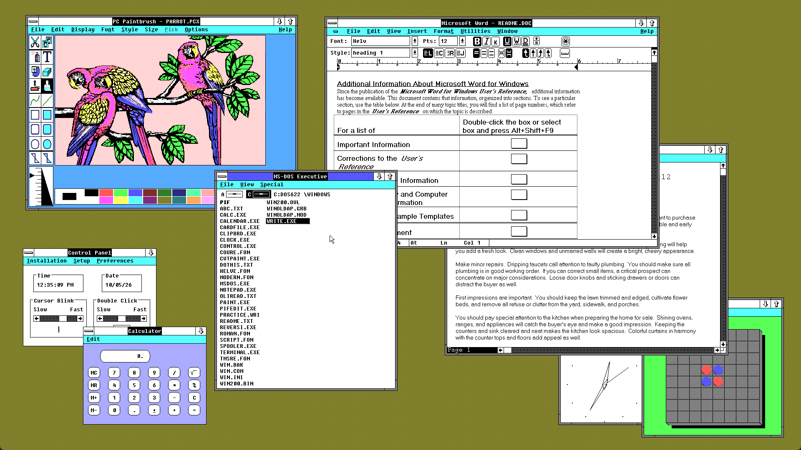
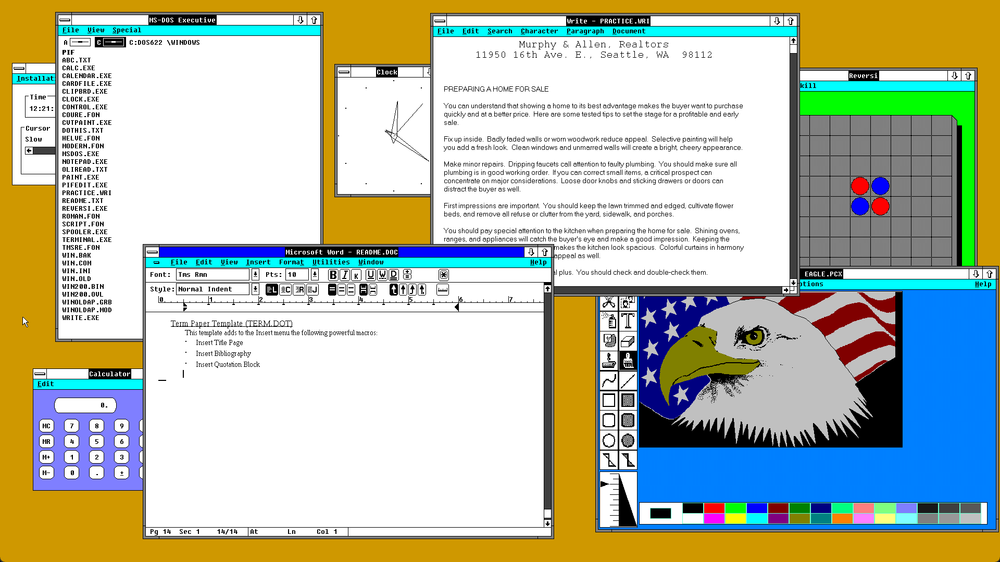
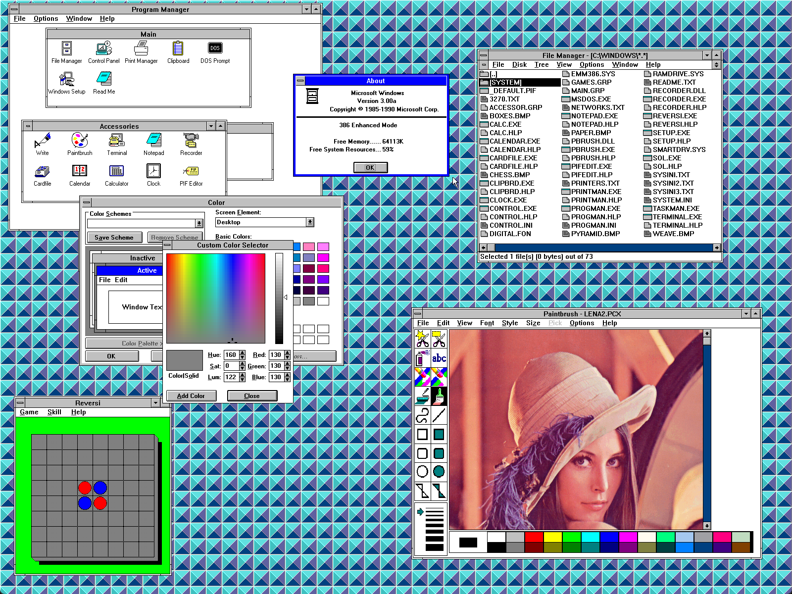

# VESA/VBE display drivers for Windows 1, 2, and 3.0.

Dmitry Brant, 2026.
https://dmitrybrant.com

See the subfolders in this repo:
* Drivers for Windows 1.x: [win1vbe](./win1vbe)
* Drivers for Windows 2.x: [win2vbe](./win2vbe)
* Drivers for Windows 3.0: [win3vbe](./win3vbe)

## Examples

Windows 1.04 running in 1280x1024 resolution!

---

Windows 2.03 running in full HD (1920x1080)!

Windows 2.03 running in full HD (1920x1080) and 256 colors!

---

Windows 3.0 running in 1600x1200 with 24-bit TrueColor!

## For Windows 3.1x

For VBE drivers that work with Windows 3.1, see the excellent [vbesvga.drv](https://github.com/PluMGMK/vbesvga.drv) repo.
