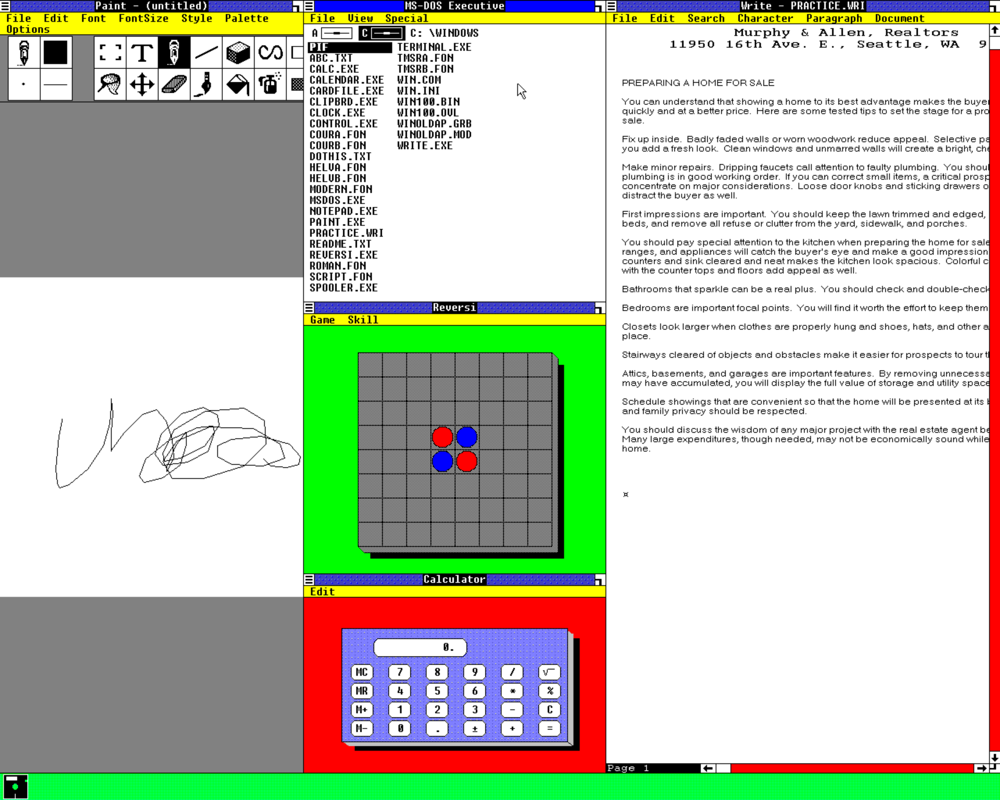

# VESA/VBE display driver for Windows 1.0x (800x600 up to 1920x1080)

Dmitry Brant, 2026.
https://dmitrybrant.com

Display driver for Windows 1.0x that runs Windows at 1024x768 and higher. It
works on any video adapter whose BIOS supports **VESA VBE 1.2 or later** and
offers a banked 256-color mode at the chosen resolution. It also works on
QEMU's standard VGA adapter. A 386 or later CPU is required.

| Driver             | Resolution | Colors |
|--------------------|------------|---------|
| VBE800 / VBE800C   | 800x600    | 8 / 16  |
| VBE1024 / VBE1024C | 1024x768   | 8 / 16  |
| VBE1152 / VBE1152C | 1152x864   | 8 / 16  |
| VBE1280 / VBE1280C | 1280x1024  | 8 / 16  |
| VBE1600 / VBE1600C | 1600x1200  | 8 / 16  |
| VBE1920 / VBE1920C | 1920x1080  | 8 / 16  |

The 8-color drivers look exactly like the stock Windows 1.0x EGA driver. The
`C` drivers have 16 colors, which Windows 1.0x never had: colors outside
the 8 EGA ones (such as the default desktop green) appear as finer dithers.

Here is Windows 1.04 running in 1280x1024 resolution:

## Installing

Windows 1.0x SETUP links the display driver into `WIN100.BIN`/`WIN100.OVL`,
so the driver has to be installed with SETUP. SETUP has a fixed list of
display drivers. `MKSETUP.COM` makes a copy of SETUP whose "EGA (more than
64K)" entry installs the VBE driver instead, and keeps that entry's EGA font
set.

`win1vbe.img` is a 1.44 MB floppy image with every driver (`.DRV` plus the
`.GRB` and `.LGO` files SETUP expects next to it), `MKSETUP.COM`,
`VBELIST.COM` and a short README.

1. Copy all files from the Windows 1.0x setup disks into one directory, e.g.
   `C:\WINSETUP`, and copy the driver's `.DRV`, `.GRB` and `.LGO` files there
   too:

       copy a:vbe1024c.* c:\winsetup

2. In that directory, run MKSETUP with the driver's name:

       a:mksetup vbe1024c

   It writes `VBESETUP.EXE`.
3. Update an existing Windows installation (substitute your keyboard and
   mouse drivers):

       vbesetup /q c:\windows usa.drv mouse.drv vbe1024c.drv

   Or run `VBESETUP` for a new installation and choose
   *VESA/VBE display driver* as the display.

## Where it runs

Like the [Windows 2.x driver](../win2vbe), the driver asks the video BIOS for
a 256-color packed-pixel mode at its resolution and sets it. It honours the
card's window granularity, read/write windows and pitch. It falls back to the
Bochs/QEMU "DISPI" registers if the BIOS has no such mode.

Tested on:

* QEMU `-vga std`: 1024x768 and 1280x1024, 8 and 16 colors;
* 86Box with the S3 Trio32 PCI (its VESA BIOS) at 1280x1024, with a Microsoft
  serial mouse.

## Mouse in QEMU

Windows 1.0x has drivers for serial and bus mice, not PS/2, so in QEMU the mouse
must be `-serial msmouse`. Two things get in the way there:

* **Detection.** Windows 1's `MOUSE.DRV` resets the mouse by keeping DTR on and
  raising RTS, and expects an `M` in reply, as a real Microsoft mouse sends.
  QEMU's emulated mouse (QEMU 10) only resets when DTR and RTS both go from off
  to on, so it answers too early, the reply is discarded, and Windows runs
  without a mouse (no cursor). The DOS `MOUSE.COM` of that era fails the same
  way. Workaround: in the installed `WINDOWS\WIN100.BIN`, find the bytes
  `83 C2 04 B0 01 EE` (offset 0x91E6 with Windows 1.04 and `MOUSE.DRV`) and
  change the `01` to `00`. The driver then switches both lines off first, which
  QEMU understands and which also resets a real mouse.
* **Floods.** QEMU delivers queued mouse packets back to back, not at 1200 baud,
  and Windows' USER handles nested mouse events on a small private stack. Fast
  movement can overflow it and hang Windows, even with the stock EGA driver
  (in testing at about 1000 events per second). This driver keeps the work per
  mouse event small: it redraws the cursor at most about every 8 ms, and it
  lets waiting mouse interrupts run on its own 4 KB stack. In the same test it
  survived 1500 events per second.

86Box's serial mouse needs neither the patch nor fast movement precautions.

## How it works

The drawing engine is the one from the Windows 2.x driver: an 8 bpp banked
frame buffer, presented to GDI as a planar device (3 or 4 planes), a common
row engine for BitBlt/Output/text/Pixel/ScanLR, and a software cursor. The
Windows 1.0x specifics:

* **Driver interface.** It is a subset of the 2.x one, with the same calling
  conventions and structures for the shared functions. The exports are
  BitBlt, ColorInfo, Control, Disable, Enable, EnumDFonts, EnumObj, Output,
  Pixel, RealizeObject, StrBlt, ScanLR, DeviceMode, Inquire and the cursor
  functions. GDIINFO is version 1.00, with BitBlt as the only raster
  capability. There are no bitmaps over 64 KB.
* **Fonts.** Windows 1.0x fonts (version 1.00) keep all glyphs in one bitmap
  strip, `dfWidthBytes` per scan line. Proportional fonts have a table of
  glyph start columns, and GDI passes a far pointer to the bits.
* **Module format.** It is linked like Microsoft's Windows 1.0x drivers
  (linker version 4.0). There is no initialisation entry, so KERNEL patches
  each export's `mov ax,ds / nop` prologue to load the driver's data segment.
  Resources (cursors, icons, system bitmaps) come from the stock
  `EGAHIRES.DRV`.
* **DPI.** Windows 1.0x has no raster fonts for square pixels, so the driver
  reports 96x72 dpi and uses the EGA font set. As with any VGA driver for
  Windows 1, text is a little shorter than on an EGA screen, but crisp.

## Tested

MS-DOS Executive (menus, dialogs, file lists), Write
(PRACTICE.WRI with fixed and proportional fonts), Paint, Reversi, Clock,
Calculator, Cardfile, Terminal, windowed DOS programs (COMMAND.COM),
full-screen DOS programs and the switch back to Windows, and the mouse
(including heavy random movement and double-clicks, on 86Box). See
`screenshots\`.

## Building

Needs Python 3 and [NASM](https://www.nasm.us).

    cd src
    python build.py --nasm C:\path\to\nasm.exe --floppy ..\win1vbe.img

It writes the drivers, `MKSETUP.COM`, `VBELIST.COM` and `README.TXT` to
`drivers\`. It needs the stock Windows 1.0x `EGAHIRES.DRV` in `src\`.
`--debug 1` builds drivers that log to the Bochs/QEMU debug port (0xE9).

The sources are those of the Windows 2.x driver, adapted. `vbe.asm`
(includes), `defs.inc` (structures, Windows 1 prologue), `text.asm` (StrBlt
with 1.00 fonts), `enable.asm` (GDIINFO 1.00), `mkne.py` (Windows 1 module
layout) and `mksetup.asm` (the SETUP patcher) differ the most.

Inspired by [John Elliott](https://www.seasip.info/)'s WIN1VGA patches, which
showed how Windows 1.0x SETUP picks up display drivers.
